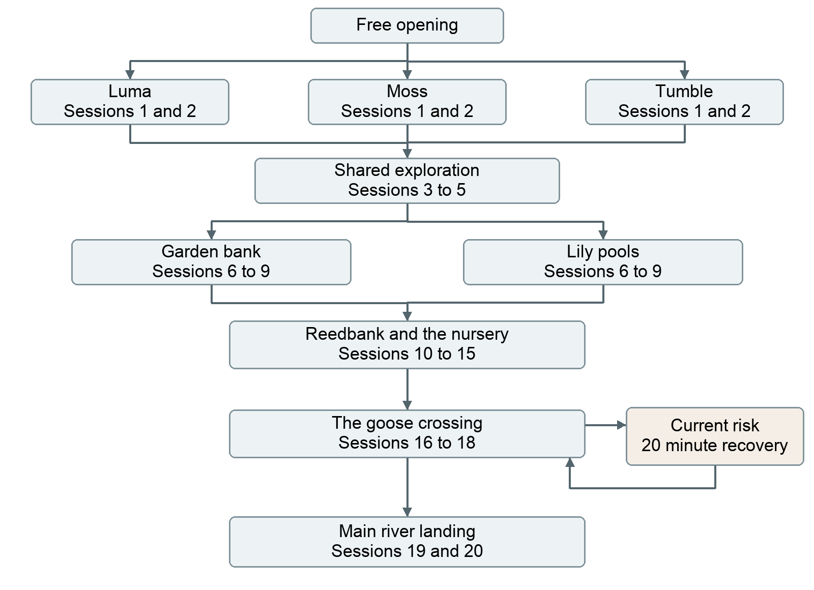

# Edenia Duck Adventure Chapter 1

*The World in the Reeds*

*Detailed story and branching design*

Pip is a curious baby duck separated from her parents during her first journey beyond the pond. Chapter 1 follows her through a small marsh full of unfamiliar creatures, ordinary wonders, and consequential choices. She learns to ask for help, makes friends, and reaches a safe landing on the main river.

The chapter supports approximately twenty learning sessions on a typical route. The opening is free. A normal story step is earned through roughly thirty to sixty minutes of study and contains an encounter, a decision, and a meaningful outcome. The goose first appears in person around session sixteen. The reunion with Pip's parents belongs much later in the adventure.

This document contains the opening script, twenty detailed encounters, alternate routes, dialogue, consequences, continuity rules, and the closing message. It is intended for developing the story before committing to finished artwork or implementation. The game remains a pixel art adventure with choices that lead between authored situations.

### Chapter commitments

- Preserve the family swim, the leaf disguise, the three curiosities, the separation, and the familiar creature returning.

- Allow substantial exploration before the goose encounter.

- End with safety and evidence that the parents are searching. After the free opening, Pip does not see, speak with, or reunite with them in this chapter.

- Remember friendships, discoveries, promises, and the player's outgoing message.

- Reserve the extra study consequence for a clearly warned, unusually reckless action.

### Document navigation

- Chapter structure and route map

- Characters and relationships

- The complete free opening

- The twenty detailed encounters

- The closing sequence and messages

- Study rewards and story continuity

- Route variations and Chapter 2 handoff

Version 1 | 24 September 2026

Adventure working title: Just One Little Look. Character names and detailed dialogue remain open to revision.

## Chapter shape and reading guide

The immediate journey is from the sheltered bank inside the reeds to a safe river landing. The old willow remains the destination Pip remembers from the morning. Leaving the marsh gives her access to the larger river journey toward it; she does not reach the willow during Chapter 1.

### Pacing across the chapter

| Sessions | Area | Narrative purpose |
| --- | --- | --- |
| 1 to 5 | The little waterways | Establish a relationship and let Pip discover her own usefulness. |
| 6 to 10 | Garden or lily pools | Explore a distinct route and make connections that can matter later. |
| 11 to 15 | Reedbank | Belong somewhere temporarily and help change a small part of the world. |
| 16 to 18 | The goose crossing | Use earlier discoveries and accept the consequences of a chosen approach. |
| 19 to 20 | Main river landing | Reach safety, receive a message, and choose how to answer. |

### How to read an encounter

Each encounter includes its entry situation, a passage of narration or dialogue, the player's choices, and the state carried onward. Dialogue is intended as usable story text. Descriptions of outcomes are instructions for expanding the scene, rather than text that must all appear on screen.

The numbered encounters describe a reference route of twenty earned steps. Garden and water alternatives occupy the same session positions; the player does not complete both routes in sequence. A well-prepared route may combine encounters 17 and 18. Optional discoveries can add one or two encounters. The current planning range is eighteen to twenty-two normal sessions, with approximately twenty as the target.

### The reward inside a step

A step includes its setup, smaller interactions, main choice, immediate consequence, and a safe stopping point. Looking around, rereading dialogue, checking an already discovered item, and retrying an ordinary unsuccessful idea remain inside that step. The next earned step begins a new encounter. A player should finish each step with a discovery, a changed relationship, a solved problem, or movement into a meaningfully different situation.

Actual point prices are still to be calibrated. The twenty-session reference route represents roughly ten to twenty hours of accumulated study. Time away from Edenia does not advance fictional danger or make Pip's circumstances deteriorate.

## Branches and reconnection points

The opening curiosity selects the first acquaintance and the initial version of encounters 1 and 2. From encounter 3 onward, scenes have shared situations with companion-specific responses. Encounter 5 selects a sustained route through either the garden or the lily pools. Both routes reach Reedbank during encounter 10.

Reedbank remembers how Pip helps the tadpoles. This choice can alter the help available at the crossing and the stories told about Pip later. At the goose crossing, bargaining, evasion, and careful passage create different relationships with the goose. The reckless-current branch passes through recovery before joining the far-bank outcome.

The route map represents situations, not screens. A single encounter can contain several short exchanges without charging another study reward. Revisiting a known place can reveal a change, but cannot repeatedly award the same object or friendship.

### Geographic continuity

The garden runs along higher ground beside the marsh. The lily pools follow its quieter water channels. Reedbank sits where those routes meet. The goose controls a narrow causeway above a fast mill channel between Reedbank and the main river landing. Safe alternative passages exist around that local crossing; they do not provide an immediate route to the parents.

## Pip and her first companions

### Pip

Pip is small, sincere, and intensely interested in ordinary things. She asks practical questions from unexpected angles. Her confidence arrives in bursts. She can be frightened without losing her curiosity, and funny without knowing she is being funny. Her growth appears through what she attempts and whom she remembers, rather than a spoken lesson at the end of each scene.

Her immediate goal is the old willow. Her deeper need is the familiarity of her family. She gradually discovers that she can receive care from others and offer it herself. Use she and her consistently. Avoid making every choice a test of whether she is a good duck.

### Luma the butterfly

Luma is theatrical, quick to improvise, and reluctant to admit that her beautiful directions assume everyone can fly. She notices colors, movement, and distant landmarks. She can scout or carry a light message, but cannot transport Pip or heavy objects. Her humor comes from recovering her dignity after small mishaps.

Luma likes being listened to and becomes more reliable when Pip helps translate an aerial route into a route along the ground. She can travel beside Pip by resting on reeds between short flights. She should never solve an entire encounter before the player has chosen an approach.

### Moss the turtle

Moss is patient, observant, and quietly amused by haste. She knows how the marsh changes with the water. Her shell can support a light passenger across a calm pool, but strong channels are dangerous for her too. She remembers old arrangements and can question the goose's claim to ownership.

Moss pauses because she is paying attention, not because she is incapable. Pip can scout ahead and return, help dislodge something, or speak for her in a crowded place. Their friendship should feel reciprocal.

### Tumble the frog

Tumble loves experiments and shortcuts. He is generous and often wrong about how easy something will be. His knowledge of low passages and soft banks is useful when checked. He does not deliberately expose Pip to danger. At the fast channel he gives an honest warning.

Tumble appreciates a companion who will try things with him and say when an idea needs changing. His growth can mirror Pip's: he learns to inspect a route before confidently announcing that he knows it.

## Family and marsh residents

### Mama and Papa

Mama is affectionate and practical. Papa joins Pip's small absurdities and makes her feel taken seriously. They are actively searching after the separation. Chapter 1 shows their care through the opening and the message at the landing. Do not add a near reunion, a silhouette across the water, or a live conversation before the chapter ends.

### Bram the acorn boat beetle

Bram carries useful odds and ends between marsh households. He speaks as though his acorn cup is a grand trading vessel. Pip meets him in encounter 3. The rescue determines whether his boat, cargo, or both remain available for later help. His gratitude survives every ordinary successful rescue outcome.

### Nell the snail messenger

Nell carries messages along the garden bank. She is careful with their contents but has confused two delivery routes. She becomes a possible source of an introduction at the landing. Her slowness is treated as a fact of travel, not an excuse to make her foolish.

### Sedge the Reedbank host

Sedge, a water vole, organizes the shared table at Reedbank. She notices who has eaten, who needs a bed, and who has useful information. She gives Pip a place to belong without demanding labor as the price of being welcomed. The tadpole problem is a genuine community concern that Pip may help in several ways.

### The goose

The goose is vain, territorial, and fond of rules that benefit him. He is capable of keeping a bargain and remembering an insult. His size makes him intimidating to Pip, but his behavior leaves room for humor. Keep him unnamed in the first chapter so his own elaborate introductions can become a running joke. He is neither the architect of the separation nor the explanation for every marsh problem.

### The landing keeper

The keeper manages ropes, notices, and messages at the main river landing. A name and species can be chosen later. The keeper recognizes Pip's name from a message entrusted to the landing network. This is the chapter's strongest direct evidence that the parents are looking for her.

Ant workers, dragonflies, tadpoles, and the water beetle at the lily pools can remain lightly characterized supporting roles. Give recurring creatures one recognizable habit or way of speaking; avoid introducing a new named cast member at every stop.

## Free opening the family swim

The opening begins before any explanation of points or study rewards. Let the player meet the family and make one small discovery. The following narration preserves the established opening.

> Pip has been swimming for seven whole days.

> She considers herself quite experienced.

> Today, Mama and Papa are taking her beyond the pond.

The family approaches a low branch. Mama lowers her head. Papa follows. Pip ducks too early, disappears underwater, and comes up wearing a leaf. The moment should be gentle and brief; it introduces her enthusiasm and the parents' affection.

> “Excellent disguise,” says Papa.

> Pip keeps the leaf.

Mama points downstream toward a bend. The willow itself is outside the player's immediate view. Its description gives Pip a memorable destination rather than a precise route she could simply follow unaided.

> “We're having lunch at the old willow. The tree with its feet in the water.”

> “Do trees get cold feet?”

> “Ask it when we arrive.”

They continue swimming. Pip follows, copying the little sideways wiggle of Mama's tail. The player can let this moment play or advance the dialogue. No decision is needed to prove that Pip loves her parents; their familiarity is already visible in how they speak.

### The first invitation

Three curiosities become available: a flower at the water's edge, a warm rounded rock, and a trail of bubbles. The prompt asks what catches Pip's attention. Each choice opens a distinct short exchange and selects the creature who will return after the separation.

The choice carries no price and no danger label. Curiosity begins the story and remains a valued part of it. None of these actions should be framed retrospectively as a moral failure deserving punishment.

### Continuity to retain

Pip wears the leaf briefly and loses it during the distraction or her turn back toward the river. It is a visual continuity detail, not a permanent inventory reward. The parents' lunch destination is the old willow. Pip knows how they sound and recognizes their affection. The first scene ends with her attention moving toward one of the three curiosities.

## Free opening the three curiosities

Only the selected curiosity plays. Keep each version similar in length and equally inviting. The text establishes an acquaintance; a dependable friendship develops through later choices.

### The flower

> Pip stretches her neck toward the flower.

> Something blue is folded between the petals.

> She takes a very careful sniff.

> Then a very large sneeze.

A butterfly tumbles out, catches herself in the air, and finishes with a bow.

> “You arrived just in time for the ending,” says the butterfly.

> “Were you asleep?”

> “Only during the middle.”

She introduces herself as Luma. Pip can apologize, ask about the performance, or laugh. All three replies produce a warm exchange. Luma's response later can recall the chosen reply without turning it into a hidden penalty.

### The rock

> The rock is warm beneath Pip's feet.

> She climbs a little higher.

> An eye opens.

> “Most visitors knock.”

> “I'm sorry. I thought you were a rock.”

> “It has been a restful misunderstanding.”

The turtle introduces herself as Moss. Pip steps down and apologizes to two nearby ordinary stones, just in case. Moss watches with quiet amusement. She is caught slightly against a submerged root, a situation that becomes apparent in encounter 1.

### The bubbles

> Pip follows one bubble, then another.

> A frog surfaces with a third balanced on his head.

> “Underwater hats,” he announces.

> The bubble pops.

> “That one was for summer.”

The frog is Tumble. Pip can ask how the hats work, suggest trying a leaf, or attempt a bubble herself. Tumble takes every suggestion seriously. Their exchange ends with his attention briefly on his experiment and Pip turning to show her parents.

### Carry forward

Remember the selected creature and Pip's reply as the opening memory. The creature may echo it in encounter 1, at Reedbank, or in the farewell. These are personal callbacks rather than three differently priced character classes. No inventory item or special ability is required to finish the chapter.

## Free opening the separation

The family has rounded the bend while Pip investigates. A quiet pause changes the scale of the river. Preserve the established narration and the distant response from a parent.

> Pip turns to show Mama.

> There is the branch.

> There is the leaf she dropped.

> There is a long, empty ribbon of water.

> “Mama?”

From beyond the reeds comes a faint answer.

> “Pip?”

Pip paddles toward it. The reeds divide the stream, and the next call seems to come from a different passage. She cannot identify the route. She climbs onto a sheltered bank.

> For the first time all morning, the river seems very big.

Allow a short pause, then return the creature from the selected curiosity. Luma lands beside Pip and asks whether she is looking for the two big ducks. Moss raises her head and says, “They'll be looking for you, too.” Tumble puts aside his joke and asks which way the family was going.

> “The willow. The one with its feet in the water.”

The creature knows how to begin, although reaching the main river will take a journey through the marsh. Preserve the distant goose exchange as foreshadowing.

> “We'll have to get past the goose.”

> “Is he very big?”

> A tremendous HONK rolls across the water.

> “…He thinks so.”

The companion can then add: “There are plenty of bends before we get there.” Pip is on a safe bank beside someone familiar. This is the first pause in which the study reward can be introduced.

### First earned continuation

The next step promises a specific encounter: help Moss get moving, find a walkable route with Luma, or prepare to leave with Tumble. The player can revisit the opening exchange while earning the reward. No clock advances a threat against Pip, and the first reward is not presented as a payment required to keep her safe.

### Save at the pause

Remember the selected acquaintance, opening reply, completed introduction, and current bank. An interrupted return resumes here. It does not replay the family separation as a new event or select a different first acquaintance.

## Session 1 Someone answers

*Area The sheltered bank | Route First acquaintance | Next Session 2*

The first paid encounter gives Pip a useful action and establishes how she will travel with her acquaintance. Each variant ends with a route forward, including when the player prefers to continue independently.

### Moss route

> “I have to find my parents,” says Pip.

> “Yes,” says Moss.

> “Quickly.”

> “Usually.”

Moss attempts to move. A root catches beneath her shell. Pip notices that the turtle was already stuck when she climbed aboard.

> “I was hoping to make a better first impression,” says Moss.

Help her turn with the current. Pip tests which way the root bends and nudges a loose twig away. Moss frees herself and offers to travel together. Find someone to pull. Pip calls a nearby water beetle; cooperation succeeds, and Moss remembers that Pip knows when to ask. Ask for directions first. Moss gives the route and explains where she will catch up after freeing herself. Pip receives guidance without being forced to promise companionship.

### Luma route

Luma describes a route over a hedge, realizes the problem, and starts again. Find a ground route together establishes a partnership. Scout ahead while I follow the bank makes Luma a returning guide. Show me the next landmark lets Pip travel independently. A low passage beneath the bent flower stem provides the first small success.

### Tumble route

Tumble announces their departure, then realizes his belongings are spread across three leaves. Help gather them begins a close partnership. Make a smaller bundle earns his respect for a practical idea. Meet me at the next pool starts a looser traveling arrangement. His bundle contains ordinary objects and one treasured but useless smooth seed.

### Consequence and stopping point

Record whether the acquaintance travels beside Pip, scouts and returns, or remains a contact. Every version reaches the creature's home or usual resting place in session 2. Let Pip perform a successful action herself. The encounter closes with the creature using her name naturally, giving a small sign that she now belongs in someone else's attention.

## Session 2 A very small home

*Area First companion habitat | Route Companion variant | Next Session 3*

This encounter lets the player spend time in a life smaller than the larger quest. Pip discovers that the marsh contains homes, habits, and objects that matter to their owners. An independent Pip can still visit the place described by her acquaintance.

### Three versions of the visit

Luma's flower patch has favorite landing places chosen for different winds. She calls one broad leaf the guest room. Moss rests in a pocket of warm mud beside a bank of objects carried there by the water. Tumble's pool contains several abandoned inventions and an excellent place for echoes.

> “Do you live here?” asks Pip.

> “Mostly,” says Tumble. “Sometimes I live over there. It depends where I left everything.”

### The main choice

Explore the surroundings. Pip discovers a small loose reed loop that can tie or retrieve light objects. It is an ordinary object she is allowed to take. Ask about the river. The acquaintance explains that floating leaves reveal the quiet edge of a current. Record this as water knowledge. Help before leaving. Pip steadies a flower stem, sorts Moss's misplaced objects, or repairs the edge of Tumble's leaf shelf. Record a closer relationship and a specific remembered favor.

These outcomes are alternatives. The player may still read descriptions of the other objects and surroundings; only the chosen extended action provides its recorded benefit. Show the result clearly, without announcing a hidden numerical friendship score.

### A small departure

Luma offers a safe place to land when Pip learns to fly. Moss says that no invitation is needed to sit on her bank. Tumble demonstrates the echo and accidentally says goodbye to himself twice. Pip can leave with gratitude, a joke, or a promise to visit. The promise becomes a line in the journal rather than an obligation with a deadline.

### Continuity and fallback

The reed loop, water knowledge, and closer friendship can each help later, but none is essential. If an object is used up, another route remains available. If the player returns to the home in a later chapter, show the effect of the favor. All versions lead to a floating acorn cup turning in the water ahead.

## Session 3 The upside down boat

*Area A quiet bend | Route Shared with companion responses | Next Session 4*

An overturned acorn cup circles against a root. A beetle clings beneath its rim while bits of cargo drift away. This is Bram, who insists on describing his cup as a trading vessel even while it is upside down.

> “Passenger assistance would be appreciated!”

> “Are there passengers?” asks Pip.

> “One. Very important to the captain.”

The water is calm enough for the rescue. Pip has time to make a choice. The stakes concern what can be recovered, rather than whether a slow reader causes Bram to drown.

### Choices

Lift Bram onto the bank first. Pip secures him immediately. Some cargo escapes downstream and the cup remains damaged. Bram remembers the care she took with him and will gladly vouch for her later.

Steady the cup and turn it carefully. Bram climbs into the upright cup. The boat is preserved, but Pip can save only part of the cargo. The reed loop makes this easier if she has it; a forked twig provides a complete alternative.

Organize a rescue with help. A companion, or nearby insects if Pip is alone, holds the cargo against the bank while she frees Bram. More cargo survives. The cup develops a split that will need repair. Pip learns that calling for help can change the result.

### The cargo

Use a few memorable objects: a bright button, a coil of reed cord, and seed parcels intended for Reedbank. Bram retains ownership of them. If he offers Pip a small gift later, write that transfer explicitly. Rescuing a trader never silently grants his entire cargo as inventory.

### Outcome and callback

All ordinary outcomes leave Bram safe and grateful. Remember the condition of the cup and the recovered cargo separately. In session 9, he can provide transport if the boat survived, cord if the cargo survived, or an introduction in every case. If he lacks the specific resource, his gratitude still matters.

Bram departs to repair or deliver what remains. Pip watches the little vessel go, then notices that the route ahead crosses a narrow stream.

## Session 4 Across the little stream

*Area A side stream | Route Local branch | Next Session 5*

The side stream is modest to the adult creatures but broad to Pip. A fallen root crosses part of it. A large leaf turns in an eddy. A dark opening follows the bank beneath the roots. The encounter gives Pip an early experience of choosing a method rather than being handed a single solution.

> Pip looks at the far bank.

> It does not look far until she looks at the water between.

### Choices

Cross with help. Moss can steady a calm crossing. Luma can identify a shallow shelf from above. Tumble can test the footing. If Pip is alone, she asks an insect on the far bank to point out the shallow edge. Remember that Pip chose cooperation.

Make a little raft. Pip uses the broad leaf and a short stem to guide it through the eddy. Water knowledge from session 2 gives her an immediate insight; otherwise, one harmless practice turn teaches her the same local principle. The successful ride reveals a patch of blue flowers hidden from the main bank.

Investigate the root passage. Pip follows a short tunnel, encounters an echo and a harmless beetle, and emerges beside the far bank. The passage loops once before she finds the exit. Remember that she has explored a low bank passage.

### A forgiving first experiment

A failed raft launch spins Pip back to the near bank. A wrong turn in the root passage returns to a familiar root. Both provide information and allow another action within the same encounter. They do not trigger the later twenty-minute recovery rule. This establishes that trying things is usually worthwhile.

### Result and stopping point

Every route reaches the raised bank beyond the stream. Give each its own detail: an offered hand, an unexpected glide, or the pleasure of finding a hidden exit. Keep the selected method in the journal. The root knowledge can help interpret Tumble's route at the goose crossing, while water knowledge can help recognize why the fast channel is a different level of danger.

Pip climbs the last few inches of the bank. For the first time, the reeds no longer fill her whole view.

## Session 5 The world gets bigger

*Area The raised bank | Route Major choice | Next Session 6G or 6W*

Pip reaches a patch of higher ground. Behind her are the little waterways she has crossed. Ahead, the marsh opens into two possible journeys. The moment should give the player a sense of scale and the satisfaction of having moved somewhere.

> Pip had thought the pond was most of the world.

> From here, she can see several places the pond has never mentioned.

One route follows a wild garden along the higher bank. The other threads through lily pools. Farther away, small shelters cluster around a landing. Her companion, or a sign beside the path if she is alone, identifies the settlement as Reedbank, where travelers may know the main river route.

### The route decision

Take the garden bank. Promise dry passages, small households, and the possibility of asking travelers for directions. This route leads through the ants, Nell's deliveries, and a forgotten picnic basket. Its useful outcomes tend toward introductions, favors, and light objects.

Follow the lily pools. Promise quiet channels, new water creatures, and opportunities to learn how the marsh connects. This route leads through dragonflies, a water beetle's missing marker, and a bottle among the roots. Its useful outcomes tend toward route knowledge, signals, and passage.

Neither route is labeled easy or correct. Describe what Pip can reasonably know. The first companion can offer a preference without choosing on the player's behalf. Moss knows the bank; Tumble likes the pools; Luma can see parts of both. Their preference is conversation, not a compulsory bonus route.

### What remains behind

Pip can look back and name one thing she has learned. Use a short callback to the stream crossing or Bram. If she has promised to visit her acquaintance's home again, record the place on the journal map. No countdown starts on that promise.

### Destination and route length

The selected route supplies encounters 6 through 9. Encounter 10 brings both to Reedbank through different entrances. Switching routes before entering encounter 6 is free. After that, a deliberate cross-route detour may add an optional scene and preserves existing discoveries. It must not replay already completed rescues or award their rewards twice.

## Session 6 Entering unfamiliar territory

*Area Garden bank or lily pools | Route G or W | Next Session 7 on the same route*

The selected route becomes tangible through a local activity. Pip enters a place where other creatures have been busy without knowing anything about her quest. She can participate, negotiate, or find her own passage.

### Garden route the great crumb

An ant procession is moving a picnic crumb across the narrow path. To Pip it is a crumb; to the workers it is a complicated transport operation. Their leader studies the ground as though planning a bridge.

> “Is that lunch?” asks Pip.

> “Tuesday,” says an ant.

> “All of Tuesday?”

> “If we get it home.”

Help with the crossing. Pip braces a leaf while the ants move the crumb. She earns a favor and learns which garden paths remain dry. Negotiate a passage. She offers to carry a message to the next workers. Record a small promise fulfilled during session 7. Find her own route. She slips through a gap in the hedge and finds an abandoned button, separate from Bram's cargo. No one treats her independence as hostility.

### Water route the dragonfly course

Dragonflies skim around floating stems, practicing a course. Pip assumes they are searching for something. They assume she has come to judge the turns.

Ask for a guide. Pip helps choose a visible start marker, and a dragonfly shows her the quiet channel. Follow their course along the water. She discovers which turns are navigable at her size and learns a useful signal. Explore beneath the leaves. She finds a sheltered passage and emerges with a tiny floating seed pod that can serve as a marker later.

### Shared outcome

Pip reaches the next resident on her route: Nell on the garden bank or a water beetle beside an unmarked pool. Record one clear benefit from the chosen action. Other details remain available as flavor, but the player should understand which favor, object, or knowledge she actually gained.

### Callback and stopping point

If Bram's boat passes in the distance, he waves and uses his grand title for Pip as rescuer. This appearance confirms continuity without delivering the session 9 payoff early. Close with the next creature asking a small, specific question that invites the following encounter.

## Session 7 Someone with a problem

*Area Message path or unmarked pool | Route G or W | Next Session 8*

The problem belongs to someone else, but Pip can choose how deeply to become involved. Information or a friendly introduction remains available even when she chooses a practical exchange instead of an extended favor.

### Garden route Nell and the two messages

Nell knows which message belongs to which recipient; she has confused the paths to their homes. One household needs news about a delivery, while another is waiting for an invitation. The contents remain private unless the recipient chooses to share them.

> “I remember the left turn,” says Nell.

> “Which left turn?”

> “That is where my remembering becomes less useful.”

Visit the nearer home first. Pip gets a quick confirmation of the route and a small household anecdote. Take the urgent delivery news first. She travels farther within the encounter and earns Nell's confidence. Ask the ants to guide them. An ant favor or the message promise from session 6 provides a natural connection; without it, Pip can ask politely and carry a small twig in exchange.

At the end, both messages have a route to their recipients. Nell offers an introduction for travelers at the main river landing. The introduction is recorded only if Pip accepts it.

### Water route the missing home marker

A water beetle recognizes the neighboring pools by their floating markers. His own marker has drifted away, and several entrances now look alike.

Search the quiet edge. Pip uses water knowledge or follows the pattern of drifting leaves, finding the original marker. Make a replacement. The seed pod from session 6 is useful, but a fallen leaf also works. Ask the dragonflies to look from above. They locate the pool if Pip describes one detail correctly; an initial mistake leads to a harmless correction within the scene.

The beetle shows Pip a sheltered route and teaches a simple arrival signal used by local boaters. Record the signal or the original marker's recovery. Taking the marker afterward would undo the help; it remains at the beetle's home.

### Next situation

Nell mentions a forgotten basket beside the garden path. The water beetle mentions a bottle lodged among the roots. Pip may investigate or take a shorter onward encounter. Neither object is introduced as possible evidence of her parents.

## Session 8 An irresistible detour

*Area Picnic basket or bottle bend | Route Optional discovery variant | Next Session 9*

This is a chance to explore because the world is interesting. The reward can be a story, a usable object, a new acquaintance, or the satisfaction of respecting someone else's space. Avoid implying that every curiosity is part of the family search.

### Garden route the forgotten picnic basket

The basket has become a shelter. A small occupant sleeps beneath a folded napkin while rain taps on its lid. Pip hears a snore that seems too large for its owner.

Announce herself. The occupant wakes and invites Pip to wait out the shower. They trade stories. Pip learns that useful objects are often left for travelers at the landing. Explore the outside first. She notices a broken handle and can repair it with a reed loop or a fresh strip of grass. The repair earns an offered button or a promise of help. Continue along the bank. Pip finds a dry overhang and talks about home with her companion. Alone, she recalls a favorite ordinary moment with her parents.

An object belongs to Pip only when offered or clearly abandoned. The basket's inhabitant is not an enemy for having been asleep. This is a warm, slightly odd encounter with an everyday life.

### Water route the bottle among the roots

The bottle contains a rolled sketch. Its author is a frog who mapped the whole world from one pool. His own home occupies most of the paper, while the main river is a confident line labeled very far.

Retrieve and examine it. Pip discovers the map's limitations and one accurate local passage. Look for its owner. A nearby frog claims it proudly and explains the useful part. Leave it in place and follow the bank. Pip finds the same onward direction through observation, without receiving the sketch as a keepsake.

> “Have you been all these places?” asks Pip.

> “I have thought about them extensively.”

### Outcome and pace

The map can be a keepsake; it is never an authoritative shortcut to the parents. The garden button can be traded later. A player who declines the investigation still receives a complete quiet encounter and an opportunity to deepen a relationship. A longer optional investigation can be a separately earned detour only if it contains a new situation and consequence, not additional inspection clicks.

## Session 9 An earlier choice returns

*Area A route obstacle near Reedbank | Route G or W | Next Session 10*

This encounter makes the chapter's memory visible. Bram arrives while Pip is dealing with a local obstacle. His help depends on what survived the rescue, and his gratitude remains intact in every version.

### Garden route the wet ditch

Rain has filled a ditch across the bank path. The ants have a temporary crossing, but it needs bracing. A narrow side route is available farther along.

Ask the ants for help. A favor from session 6 provides assistance immediately. Otherwise, Pip helps steady a leaf while the crossing is completed. Use Bram's cord. Available if that cargo survived and Bram offers it. Pip makes a guide line and returns the unused length. Take the side route. Pip finds a drier approach and a view of Reedbank's small shelters.

### Water route the tangled lilies

A moving mat of lilies blocks the channel. Bram's cup can carry a guide line if the boat survived. A dragonfly can identify an opening from above. Tumble or Pip's earlier bank-passage experience can suggest the quiet edge.

Work with Bram. Use the surviving boat or offered cargo. Ask the local creatures. The signal or connection from sessions 6 and 7 changes their greeting and speeds the solution. Find the edge herself. Pip follows the current carefully and emerges through a narrow passage.

### The rescue remembered

If his cup was damaged, Bram says he is still repairing his finest vessel. If cargo was lost, he mentions a shortened delivery list. He never blames Pip for saving him. Give him one specific callback:

> “You lifted me out first,” says Bram. “I remember that rather clearly.”

or

> “The captain and the ship,” he says. “A very respectable rescue.”

### Outcome and stopping point

All versions reach an entrance to Reedbank. Bram can introduce Pip even when he has no transport or cord. Record any object actually consumed and any newly discovered passage. Do not collapse all past choices into a universal Bram bonus; let the form of the help show what happened.

Pip hears bowls being set out and several conversations at once. Someone at the settlement notices the travelers approaching.

## Session 10 A direction at last

*Area Reedbank entrance | Route Garden and water reconnect | Next Session 11*

The garden route arrives near the shared table. The water route arrives beside the small landing stages. Both introduce the same settlement through different first impressions. Nell, Bram, a dragonfly, or Pip's own request can provide the introduction.

> “Are you expected?” asks a resident.

> Pip thinks of Mama and Papa.

> “Somewhere,” she says.

Sedge welcomes her before asking for work or payment. Pip explains that she is trying to reach the old willow. A resident points out the main river direction and describes the crossing beyond Reedbank. This is dependable geographic information, not a claim that the parents were just seen nearby.

### Choices at the entrance

Explain the whole morning. Pip tells the story, including her distraction. The listener remembers a detail that can later appear in conversation. The response is practical and kind, without a lecture about obedience.

Ask directly for the river route. Pip receives a clear description and can compare it with what she learned in the garden or pools. A companion can fill in a missing local name.

Ask for a quiet place first. Sedge finds somewhere to rest and offers to talk when Pip is ready. The player still receives the route information before the encounter ends. Resting does not erase progress or lower a relationship.

### What Pip learns

The old willow lies beyond this part of the marsh, along the main river. Reedbank is a useful place to prepare for the crossing. The water beside the goose's causeway is much faster than the pools Pip has explored. People travel through the settlement and leave word at river landings.

### Reconnection without erasure

Keep the route identity in greetings, possessions, and acquaintances. Garden travelers may know Nell and carry her introduction. Water travelers may know the boating signal and a quiet channel. Both now share the same immediate setting, while their histories remain available for later consequences.

The step closes with an invitation to sit at the table. Pip has reached an actual destination and can see the next part of the journey more clearly.

## Session 11 A place at the table

*Area Reedbank shared table | Route Conversation branch | Next Session 12*

Reedbank is preparing a meal. Nobody asks Pip to earn her place at it. The scene gives the player a moment of ordinary company before the community problem emerges. It also provides several different ways to learn about the settlement.

> Sedge finds a bowl small enough for Pip.

> Pip looks around the table.

> “Do you all live together?”

> “Close enough to borrow things,” says Sedge. “Far enough to argue about returning them.”

### Choose a place to sit

Beside the boat repairers. Pip hears about the current near the causeway and the sheltered landing farther on. If Bram's cup was damaged, someone is repairing it here. Pip can recognize the boat and ask after him.

Beside Nell and the travelers. She hears how messages move along the river. Nell can explain what an introduction does and whom to ask for at the main landing. If Pip did not meet Nell earlier, this is a brief first meeting; no garden favor is invented.

Beside the tadpole caregivers. Pip learns that a nursery pool has become too shallow. The caregivers are concerned but already taking care of the tadpoles. Their problem leads into session 12 without making Pip solely responsible for immediate survival.

### A conversation about home

Pip may describe her parents, talk about the morning's funniest discovery, or listen. Her companion can answer a question in a way that recalls their first meeting. Use one specific memory rather than a recap of every past event.

An independent Pip can make a new contact here. Sedge knows someone who can accompany her for the next part of the marsh. This offer keeps later companion dialogue available without requiring the first acquaintance to have followed.

### Outcome and stopping point

Record the main conversation and any information genuinely learned. By the end, everyone has heard enough to know that the nursery needs a lasting solution. Sedge asks whether Pip would like to see the pool. Pip can agree to inspect it, seek someone with experience, or help with a practical part of the response.

The player's food, welcome, and safe place remain available whichever useful role she chooses next.

## Session 12 The stranded nursery

*Area Reedbank nursery pool | Route Community solution choice | Next Session 13*

A fallen branch has diverted water away from the shallow pool. The tadpoles still have water and attentive caregivers. The settlement needs a lasting plan before the pool becomes unsuitable. Fictional urgency establishes a reason to help; it does not create a real-world countdown while the learner is away.

> “Are you a very large tadpole?” one asks Pip.

> “I'm a duck.”

> “Is that what happens next?”

> “I don't think so.”

Pip inspects the pool with Sedge. Her companion can offer a perspective: Moss knows the old flow, Tumble understands shallow pools, and Luma sees the branch from above. An experienced resident provides the same essential facts if Pip is alone.

### Choose the solution

Restore the old flow. Move the fallen branch with a team. This preserves the familiar nursery and requires organizing help. Ant contacts or Bram's useful cargo can assist later, but residents provide a complete fallback.

Open a small new channel. Guide a controlled amount of water around the obstruction. This creates a new feature in Reedbank and requires care about where the flow goes. Pip's water knowledge or local guidance makes the planning clear.

Move the nursery. Help transfer the tadpoles to a nearby suitable pool. This takes transport and preparation but avoids disturbing the branch. Bram's boat can help if intact; leaf cups and residents are always available.

### A smaller role remains possible

If Pip wants experienced creatures to lead, she can fetch them and choose a supporting task. The plan still follows one of the three solutions. She is not forced to pretend she has engineering knowledge or to accept sole responsibility for the tadpoles.

### State and transition

Record the selected plan and Pip's role. Do not mark the problem solved yet. Session 13 carries out the plan and session 14 reveals the lasting result. The player should understand the tradeoff in ordinary terms: keep the nursery where it is, change how water reaches it, or give it a new home.

End with the first practical task ready to begin and the caregivers calmly keeping watch.

## Session 13 Putting the plan into motion

*Area Nursery and nearby channels | Route Selected solution | Next Session 14*

The plan becomes a scene with people doing things together. Pip should make a decision inside the chosen approach, rather than simply watch a success animation because she selected a plan in the previous session.

### Restore the old flow

A team gathers around the branch. Ask the strongest residents to lift while Pip guides produces a careful coordinated move. Use a reed line to turn the branch with the water makes use of cord or local materials. Clear small obstructions first lets Pip contribute work suited to her size. A slipping grip resets the position harmlessly and teaches the group how to try again.

### Open a new channel

The proposed route passes near a resting place used by another resident. Ask before redirecting the water earns cooperation and a better channel line. Choose the longer route around the resting place preserves it but takes more local effort within the encounter. Invite the resident to design the route with Pip creates a shared solution and a named place in the settlement.

### Move the nursery

Leaf cups or Bram's boat are prepared. Make many small trips is calm and gives Pip conversations with the tadpoles. Organize a line of helpers makes the move a community activity. Prepare the destination first gives Pip a useful scouting role. Do not turn the tadpoles into inventory objects or allow an accidental click to permanently lose one.

### Friendship shown through action

Luma can coordinate from above, Moss can steady a bank, and Tumble can inspect a pool. Each helps with one part. If a companion is absent, a local creature fills that practical role while Pip remains the protagonist.

> “Ready?” asks Pip.

> “Almost,” says Tumble.

> For once, he checks before saying anything else.

### Outcome and stopping point

The practical work reaches a stable result. Record the completed action and any object consumed. Return borrowed equipment explicitly. The emotional payoff and the settlement's response belong to session 14; end here with water beginning to move, or the last transfer arriving safely, and Pip watching to see what happens.

## Session 14 Something changes because of Pip

*Area The completed nursery solution | Route Outcome variant | Next Session 15*

The chosen solution now has a visible result. This encounter gives the player time to enjoy an accomplishment and make a small decision about what happens around it. It should not be only a congratulatory message.

### What changed

If the old flow was restored, the familiar pool fills and the fallen branch becomes a resting place on the bank. If a new channel was opened, residents decide how to cross or mark it. If the nursery moved, the caregivers prepare its new surroundings while the old pool becomes a quieter place for other creatures.

### Choose a lasting detail

Help make a place to gather. Pip helps position a small shelter, leaf awning, or resting stone beside the successful project. It becomes a recognizable landmark on a return visit.

Mark the safe route. Pip helps place signs or simple markers so small creatures can use the new arrangement. This can later support her reputation as someone who finds ways through difficult places.

Spend time with the tadpoles. Pip answers questions and tells a small part of her journey. Record one question or promise that a growing frog could remember in a later chapter.

> “Are you staying?” asks one.

> “I'm looking for my parents.”

> “Oh.”

> The tadpole thinks about this.

> “You can come back afterward.”

### Recognition without a parade

Sedge thanks Pip for a specific contribution. Bram, Nell, or the first companion may comment if present. Avoid having every resident deliver a speech. One small gesture, such as a place kept for her at the table, can carry the gratitude.

### State and transition

Record the final nursery outcome, the additional detail, and Reedbank's goodwill. These remain true after Pip leaves. The settlement may lend equipment, provide a witness to the old crossing arrangement, or prepare a small gift in session 15.

The scene ends with Pip noticing the riverward path. She has changed something here and is ready to continue the search. Her safe place at Reedbank remains available for a future return.

## Session 15 Getting ready to leave

*Area Reedbank departure | Route Preparation and companion choices | Next Session 16*

The departure combines practical preparation with a farewell. Pip can decide what help to carry forward and how she wants to travel. A goodbye does not erase the relationship she formed.

### A useful gift

The residents offer one modest gift. A reed cord helps with light securing and retrieving tasks. A polished garden button makes a possible trade at the crossing. A written introduction explains that Reedbank knows Pip and will vouch for her. If she already owns the equivalent, offer a different useful choice rather than silently duplicating a unique object.

Pip can decline a gift and keep the goodwill. All crossing routes retain a solution without a particular item. The gift changes the form or length of the approach; it is not a hidden requirement.

### Who travels onward

Continue with the first companion, if present and willing. Invite a local guide for the crossing. Go ahead independently with a meeting place or promised help farther on. A returning scout can rejoin here without inventing a close friendship that was never established.

If a companion stays behind, give a concrete reason: family, a home to tend, or a promise already made. Allow a warm farewell and record where that creature can be found again. Do not present independence as rejection.

### What the residents know

The goose claims to own the causeway. Older residents remember it as a shared crossing. He likes impressive objects and formal agreements. The sheltered edges can be investigated, but the fast channel runs toward a grating and is unsafe for a small duck. This warning prepares the later dangerous choice without making the goose responsible for the natural current.

> “Does he own the whole river?” asks Pip.

> “He has not finished writing the sign,” says Sedge.

### Departure and state

Record the gift, outgoing companion arrangement, and any remaining promises. Give Pip one chance to say goodbye at the place she helped change. End with the causeway sign appearing ahead and a tremendous honk from beyond the reeds. Keep the goose out of clear view until his introduction in session 16.

## Session 16 The goose crossing

*Area The causeway approach | Route Crossing approach choice | Next Session 17*

The goose stands above a narrow crossing. The sign beside him is large enough to have required considerable effort and contains rules that mostly refer back to the goose.

> CROSSING RULES

> 1. ASK THE GOOSE.

> 2. THE GOOSE IS BUSY.

> 3. NO COMPLAINTS.

He inspects Pip as though her size is a paperwork problem.

> “You're rather small.”

> “I'm the biggest I've ever been,” says Pip.

The causeway spans a fast local channel. Pip cannot simply swim around the argument: the open water runs toward a grating, while the calmer edges require investigation. Other small travelers wait nearby. The goose's control affects them too.

### Choose an approach

Negotiate a bargain. Pip asks what he would accept. He wants an impressive object or a useful favor. The player learns the exact proposed exchange before agreeing. If Pip has a suitable gift, the later preparation can be shorter; no object is removed merely for asking.

Question his ownership. Pip asks who used the crossing before the sign appeared. Moss or Reedbank's introduction provides context, while another waiting traveler can supply it if neither is available. Pip earns a chance to present a case rather than instantly winning the argument.

Seek help from a companion or local traveler. Luma proposes a distraction, Moss proposes a public discussion of the old arrangement, and Tumble suggests a sheltered passage. Alone, Pip can ask a waiting resident to inspect the bank with her.

Scout another crossing. Pip discovers a promising quiet edge and notices the dangerous fast channel. Reconnaissance itself is safe and yields useful information. It does not trigger the recovery task.

### Result and stopping point

Record the approach and the goose's initial response. Pip has learned something actionable: the price of a bargain, the basis for challenging him, or the location of another passage. The goose remains a character with habits and interests, not an arbitrary locked door. End with Pip deciding how to prepare the chosen plan in session 17.

## Session 17 A plan or a reckless shortcut

*Area Banks beside the causeway | Route Preparation or recovery branch | Next Session 18*

Pip acts on the approach selected at the crossing. Ordinary preparation is one earned encounter. The dangerous current is a separate choice inside it, with a clear warning and an additional recovery requirement if taken.

### Prepare a workable plan

Complete the bargain. Pip chooses whether to trade an owned button, offer a specific future favor, or withdraw and use another route. A gift is inspected before it is handed over. A favor must name the obligation; the goose cannot silently expand it later.

Build the case for shared passage. Pip gathers a witness or a remembered detail from Reedbank. She can ask the waiting travelers to speak together. This creates a social consequence: some creatures will remember her willingness to question the goose.

Prepare the quiet route. Pip and her helper check the footing, a low passage, or the moment when the goose watches his reflection. Water knowledge and the root passage from session 4 help, but local inspection provides a complete fallback.

### The reckless choice

The fast current appears to offer a direct way around the causeway. Before confirmation, show the grating and give a plain warning:

> The current is too strong. If Pip is swept away, preserving her remaining adventure points and continuing will require 20 additional minutes of video study.

> Take the risk / Choose another way

If the player proceeds, the current pulls Pip toward the grating. She catches a root and is helped onto a sheltered ledge on the near bank. Her supplies have scattered; she is safe, but the approach has failed. The scene creates one recovery task and reserves the current unspent adventure balance.

### Recovery and continuity

Completing twenty new minutes of recorded video study restores access to the reserved points and supplies. Those minutes count in study history while satisfying recovery rather than generating new adventure currency. The game returns to the safe preparation choice inside this same encounter, without charging for it again. Session 18 still follows normally: the penalty does not purchase a faster route through the chapter.

There is no timer, automatic loss during absence, or stacking of repeated recovery tasks. The dangerous option is closed after this event. Exact currency policy remains a proposed rule detailed later in this document.

## Session 18 Getting across

*Area The causeway and sheltered edge | Route Consequence of the crossing plan | Next Session 19*

This encounter completes the crossing and establishes what relationship remains behind. Use the prepared plan, current inventory, and actual companion arrangement. The player should recognize why this version of the scene is happening.

### The bargain route

If Pip chose an object trade, she confirms the exchange and crosses. The goose claims to own finer objects but keeps looking at this one. If she promised a favor, he states it clearly and Pip can repeat it back in her own words. Record an outstanding promise with a concrete description, not a general debt that can justify any later demand.

### The shared passage route

Pip presents the remembered arrangement with support from others. The goose can retain his dignity by announcing that he is opening the crossing under a newly clarified rule. Travelers gain passage. He remembers Pip as troublesome or worthy of respect, depending on how she spoke, but does not become a close friend in one exchange.

### The quiet route

Luma's distraction, Tumble's low passage, Moss's knowledge, or Pip's own scouting provides a way through. Pip chooses whether to leave unnoticed or acknowledge the goose from the far side. If he notices the evasion, he remembers it. The route is clever and locally safe; it is distinct from the warned fast-current action.

> “You could have asked,” the goose calls.

> “I did,” says Pip.

> He consults the sign.

### The final small decision

A waiting traveler needs to know whether the path is safe. Pip can explain the route, ask the goose to admit the others under the same arrangement, or continue while her companion passes on the information. This creates a last impression without turning the crossing into another unrelated quest.

### State and stopping point

Record crossing completion, the goose relationship, any item transferred, any specific future favor, and help offered to the other travelers. If recovery occurred in session 17, include one understated callback to the safer choice; do not mock Pip or replay the dangerous incident.

Beyond the crossing, the reeds thin. Pip hears a broad, unfamiliar sound: the main river moving past the marsh.

## Session 19 The main river

*Area Main river approach | Route Arrival method | Next Session 20*

The marsh opens onto water much wider than anything Pip has seen. Boats and floating leaves move in the distance. The moment brings scale and possibility rather than another immediate threat. Pip sees a small landing with shelter and people who watch the traffic.

> The river is too wide to fit between two reeds.

> Pip tries looking at all of it at once.

> After a moment, she chooses one small landing instead.

### Choose how to arrive

Help signal an approaching boat. A landing resident is replacing a loose signal marker. Pip can hold it, call at the right moment, or use the boating signal learned in the lily pools. She meets the keeper through a shared task.

Follow the bank to the steps. Pip navigates a short, quiet approach and asks for directions. A previous bank-passage discovery changes what she notices, but an ordinary marked route remains available. She arrives independently and is welcomed as a traveler.

Use an introduction. Nell's note, Reedbank's written introduction, or Bram's word connects Pip to someone expected at the landing. The greeting names the actual source. Without a written object, Pip may simply explain who sent her; the keeper can confirm through a familiar local detail.

### Information within reach

The keeper explains that landings exchange news and messages. The old willow is a recognized place farther along the river network. This encounter does not reveal where the parents are now, show them in the distance, or claim that they just departed.

If Pip has a companion, the companion reacts to the scale of the river in a characteristic way. Luma falls briefly silent, Moss identifies a quiet margin, or Tumble admits he has not tested a shortcut here. An independent Pip can share the moment with the resident she helped.

### Stopping point

Pip reaches the shelter and gives her name as part of the arrival conversation. The keeper pauses while sorting notices. The next encounter begins with the recognition of that name. This is a story invitation at a safe stopping place, with Pip already welcomed at the landing.

## Session 20 Something left for Pip

*Area The river landing shelter | Route Chapter conclusion | Next Chapter 2 opening*

The keeper recognizes Pip's name from a message left through the river network. The scene provides dependable evidence of the parents' care while keeping their present location unresolved. Do not add a chase after their boat or a near reunion as a cliffhanger.

> “Pip.”

> The keeper stops sorting the ropes.

> “Then I have something for you.”

The message is a short note from Mama and Papa. The keeper can read it aloud, or Pip can read it with her companion. Both options present the same words. The complete closing script appears on the following page.

### Receiving the message

Read it quietly. Pip takes a moment before speaking. Ask someone to stay beside her. The present companion or the keeper provides company. Read it aloud. Pip makes the words part of the room around her. These choices shape the delivery without altering the message or charging for emotional responses.

### Choosing a reply

The next boat can carry word upstream. Pip chooses a short message: that she is safe and has made a friend, that she misses them and is trying to find them, or that she helped some tadpoles and wants to tell them everything. Store the exact selected wording. A later chapter can let the parents recall the message they actually received.

### Rest and the next route

The keeper offers a warm place to sleep. Pip can rest near her companion, near the familiar sounds of the landing, or in a quiet corner. This is a preference, not a survival calculation. Before the chapter closes, the player can express interest in a bank path or a local boat route for Chapter 2. The next chapter can confirm that choice after introducing its conditions.

### Final state

Pip is safe at the landing. The parents are still searching and remain offstage. The old willow is still ahead. Friendships, the Reedbank outcome, the goose relationship, possessions, promises, and the outgoing message carry forward. The chapter ends on progress already achieved: she has crossed the marsh and made a place for herself among its residents.

## Closing sequence and outgoing messages

The keeper produces the note carefully. It is a practical message entrusted to travelers, rather than a magical object that reveals the parents' location. Let the player read it without extra prompts interrupting the passage.

> Pip,

> We are looking for you.

> If you reach a landing, ask someone kind to help. We are leaving word along the river.

> We love you.

> Mama and Papa

Pip recognizes the way Mama leaves room around the words, or a small familiar mark the family uses. That detail can be settled during art development. It should confirm a personal connection without becoming a visual puzzle the player must solve.

> “Can they get a message from me?” Pip asks.

> “The next boat can carry one,” says the keeper.

### The three reply choices

Safety and friendship: “I'm safe. I made a friend.” If Pip traveled independently, use “I'm safe. Some kind people helped me.” Store the variant actually shown.

Missing the family: “I miss you. I'm trying to find you.” Keep the answer honest. The story does not immediately promise a reunion or imply that missing them is the wrong emotional choice.

Pride in a small achievement: “I helped some tadpoles. I'll tell you everything.” If the player chose a supporting role, this remains truthful. A later response can ask about the tadpoles rather than generically praising Pip.

The keeper repeats the chosen sentence while preparing it for the boat. Pip can correct the choice before dispatch. Once the chapter confirms the message was sent, the recorded wording becomes a stable story fact.

> Pip watches the little message boat leave.

> For once, something is going ahead of her.

> Beside the landing, someone has made a warm place to sleep.

### What the ending leaves open

The message confirms that the parents are actively searching. It does not establish how recently they visited this specific landing, promise a response next session, or identify their current bank. Chapter 2 can develop the river journey without repeatedly arranging narrowly missed meetings.

The next invitation concerns a concrete new place and route. Keep the emotional ending complete before displaying that invitation.

## Study rewards and the recovery consequence

The normal reward rhythm is one substantial story step for approximately thirty to sixty minutes of learning. Video and Anki activity can contribute to ordinary adventure rewards. Exact exchange rates, existing learner balances, and the way Anki effort maps to the target rhythm still need a product decision.

### Keep two meanings of progress clear

Recorded learning achievement represents study already completed. Spendable adventure points represent the player's ability to unlock future encounters. Spending or placing adventure points at risk must not erase the study history, friendships, completed scenes, or the chapter's durable consequences.

An encounter is charged once. Its inspection, dialogue, ordinary retries, and immediate resolution are included. Reloading the page, returning from another device, or opening the same choice twice does not create a new purchase.

### Proposed recovery rule for session 17

The player receives a plain warning before taking the fast-current route. If she confirms, the story shows the failed shortcut and Pip reaching safety on the near bank. The unspent adventure balance at that moment is reserved. The normal continuation waits for twenty additional minutes of new video study.

Those minutes still count toward recorded learning achievement. In this proposed economy, they fulfill recovery instead of producing spendable adventure points. A partial video contribution can accumulate across visits. Completing the task releases the reserved balance, restores the scattered supplies, and returns to the safe preparation choices inside session 17. It does not charge again for that encounter or bypass session 18.

There is no real-time deadline. Inactivity does not subtract points. The task is created once, survives reloads, and cannot stack through repeated clicks. The dangerous option closes after it has been experienced in this chapter. Previously counted video activity cannot satisfy it again.

### Decisions to settle before implementation

The current draft uses recovery rather than automatic forfeiture. Whether to offer an explicit “forfeit the reserved balance and continue” alternative remains open. With a zero balance, the proposed rule still requires recovery to resume the story, so the dangerous action cannot become a free shortcut. Whether Anki should also satisfy this exceptional recovery task remains open; the current example specifically uses video study.

These details are design proposals for review. The story commitment is a rare, clearly warned decision that can require extra learning, with the consequences visible before the player commits.

## Story facts carried between encounters

The story needs a compact record of what actually happened. Relationships can be represented by explicit facts rather than opaque scores. A callback should name the action it remembers. The following records describe narrative meaning without prescribing a database design.

| Record | Possible content | Main later use |
| --- | --- | --- |
| Opening acquaintance | Luma, Moss, or Tumble | Sessions 1 and 2, greetings, and later reunions. |
| Opening reply | The specific free reply selected | A personal line of dialogue. |
| Companion arrangement | Traveling together, scouting, contact, or independent | Available dialogue and practical help. |
| Home visit result | Reed loop, water knowledge, or a specific favor | Sessions 4, 9, and the crossing. |
| Bram rescue | Safe beetle plus boat and cargo condition | Session 9 help and Reedbank repair details. |
| Main exploration route | Garden or lily pools | Sessions 6 to 10 and later acquaintances. |
| Nursery outcome | Old flow, new channel, or moved nursery | Reedbank appearance and future return. |
| Goose relationship | Bargain, specific favor, respect, or rivalry | Future crossings and goose encounters. |
| Recovery state | Not triggered, in progress, or completed | Session 17 continuation and balance access. |
| Outgoing message | Exact wording sent | A future response from the parents. |

### Additional facts worth keeping

Record individual favors and introductions only when earned. Keep a list of places discovered and the route Pip actually took through them. An object record should distinguish owned, borrowed, traded, consumed, and returned items. Store the prepared crossing approach until its result is complete.

### Reconnection rules

A shared scene reads earlier facts instead of resetting them. Arriving at Reedbank through the water route does not imply Pip met Nell in the garden. Meeting Nell at the table creates a new acquaintance with different dialogue. A damaged acorn cup cannot become intact merely because the scene needs a boat; use the cord, residents, or another stated alternative.

At the chapter ending, preserve the full relevant history and the outgoing message. A chapter summary is a readable recap of these facts, not a replacement that loses the details needed for later consequences.

## Objects friendships and promises

Objects remain few and recognizable. Their main role is to offer an additional action or make a later solution feel earned. Every required story transition has a route that works without a unique item.

| Object or connection | How it is acquired | Possible use | Ownership rule |
| --- | --- | --- | --- |
| Reed loop | Exploration in session 2 | Steady Bram's cup or retrieve something light | Owned until explicitly used or given. |
| Garden button | Hedge route, offered basket gift, or Reedbank gift | A trade with the goose | One clear acquisition and one transfer. |
| Reed cord | Offered by Bram or selected at Reedbank | Nursery work or route preparation | Return borrowed cord; track an owned gift separately. |
| Frog sketch | Bottle exploration with permission | Local passage clue or keepsake | A limited map, never a map to the parents. |
| Written introduction | Nell or Reedbank | Arrival at the main landing | The greeting names its actual author. |
| Boating signal | Water route | Session 19 arrival | Knowledge cannot be lost by dropping supplies. |

### Friendship changes

A companion can like Pip while choosing to remain at home. A scout can return without having shared every intervening event. Helping someone may create trust, while a practical exchange creates a narrower connection. Neither needs to be displayed as a numerical meter.

Give disagreements specific causes. If Pip promises Luma a return visit, the later conversation can mention the promise. If she leaves Moss with directions, Moss should not remember having traveled through the garden beside her. Record who actually witnessed the nursery solution and the goose crossing.

### Promises and debts

A promise names an action and a person. The goose's favor must be stated before acceptance and preserved verbatim or with equivalent meaning. Ordinary visits and invitations have no expiry while the learner is away. If a later chapter offers a chance to fulfill a promise, explain why the opportunity matters then.

### First opening details

The leaf hat is not a durable item. Bram's cargo belongs to Bram until offered. The water beetle's home marker stays at his pool. Luma cannot carry Pip; Moss cannot safely ferry her through the fast channel. These constraints keep the world coherent when branches reconnect.

## Optional encounters and route length

The twenty numbered encounters are the standard planning route. Longer and shorter paths should result from understandable choices. The following variants make the eighteen to twenty-two session range concrete while keeping the main chapter milestones intact.

### A prepared route of eighteen sessions

On the garden route, efficient delivery choices in session 7 can take Pip directly past the basket. A short look and conversation occur within that encounter, and session 8 is not purchased separately. The route then continues with session 9. At the crossing, a suitable owned gift and an agreed bargain can combine preparation and crossing into one encounter covering sessions 17 and 18. Both combinations must be visible as complete scenes, not hidden deductions from a session counter.

This route still includes all five chapter areas, the nursery outcome, the goose, the landing, and the outgoing message. It rewards preparation. The reckless-current action never grants this shortening; its recovery returns to normal preparation.

### A garden detour after session 8

The basket's occupant wants to make the shelter usable for another traveler during rain. Pip can help ask nearby households for a dry leaf, choose how to support it, and welcome the first guest. The result is a small resting place that can reappear later. The encounter ends back on the garden route before session 9. It provides a new social situation and persistent place, rather than charging again to inspect the basket.

### A water detour after session 8

The author of the bottle sketch invites Pip to test one uncertain part of his map. Together they investigate a quiet inlet and correct the sketch. Pip chooses whether to mark a safe passage or a pleasant resting place. The author later remembers being taken seriously. This occupies the same optional slot as the garden detour and returns to session 9.

### An optional evening after session 14

Pip stays for the first gathering beside the successful nursery. She can tell a story, help make shadows on a leaf screen, or listen to the tadpoles invent names for the new surroundings. The chosen moment becomes a later callback. This is an additional encounter before departure in session 15.

A route with its exploration detour and the nursery evening contains twenty-two normal steps. A route with one detour contains twenty-one. The fictional evening is authored when chosen; the learner's real-world schedule does not create it automatically.

## Reference playthroughs

These examples show how the same chapter can preserve different histories. They are narrative checks for the draft, not claims that a playable build has been tested.

### The patient traveler

Pip meets Moss, helps her out of the root, learns water knowledge, and rescues Bram first while some cargo drifts away. She chooses the garden, helps the ants, and travels with Nell. Bram later provides an introduction because his damaged boat is still under repair. At Reedbank, Pip helps restore the old pool and leaves a safe route marker. Moss accompanies her to challenge the goose's ownership. The shared crossing opens, and Pip arrives at the landing with a reputation for finding practical solutions. Her reply tells her parents that she is safe.

### The curious explorer

Pip meets Tumble, gathers his belongings, and takes the reed loop. She preserves Bram's boat, explores the root passage, and chooses the lily pools. She learns the boating signal and investigates the frog's map. At Reedbank, she helps open a new channel. At the crossing, her earlier passage experience makes Tumble's sheltered route understandable. She arrives at the landing by helping signal a boat. Her reply says she helped some tadpoles and wants to tell the whole story.

### The independent traveler

Pip meets Luma but asks for directions and travels alone. She chooses useful knowledge, calls local insects to help Bram, and takes the garden bank independently. At Reedbank, she asks experienced residents to lead the nursery move and supports them. She selects a written introduction and negotiates a specific future favor with the goose. She reaches the landing without an active companion. The friendship reply adapts truthfully to “Some kind people helped me.” No absent companion speaks or appears in her scenes.

### The traveler who takes the risk

Any route can reach the current warning. After confirming the reckless action, Pip is rescued to the near bank. One recovery task reserves the unspent balance. Returning later preserves the same task and partial video contribution. Completion restores the normal preparation choices, and Pip chooses a safe plan. The crossing, message, and chapter ending remain available without lost friendships or a shortened route.

Across every playthrough, the parents remain offstage after the free opening. No unique object is mandatory, and every shared scene reflects the history that actually occurred.

## Continuity and scene review

Use these checks while expanding dialogue, making a paper prototype, or preparing a playable chapter. They focus on the story's promises and on situations where branching content can become contradictory.

### Beginning and emotional continuity

- Preserve the family's affection and the three free curiosities. Curiosity is not retrospectively condemned as the reason Pip deserves a penalty.

- Keep the willow as the remembered destination. The chapter ends at a different safe landing, with the route toward the willow still ahead.

- Keep the distant parent response in the opening. After that opening, introduce no live conversation, sighting, or reunion during Chapter 1.

- Give the parents' message space to land emotionally before displaying the Chapter 2 invitation.

### Branch continuity

- Check each shared encounter with Luma, Moss, Tumble, and an independent Pip. Essential information always has a local fallback.

- Keep Bram's boat and cargo conditions consistent in sessions 9 and 11.

- Separate first meetings from established relationships, especially Nell at the Reedbank table.

- Verify that items are offered before becoming Pip's possessions and removed only when an explicit trade or use occurs.

- Let the nursery's selected result remain visible after departure and on future visits.

### Choice clarity

- Present enough information for the player to understand the kind of decision being made. Do not reveal every future consequence.

- Distinguish ordinary experimentation from the explicitly warned fast-current action.

- Ensure every paid encounter contains a meaningful development. Combine a prepared resolution when a separate step would only repeat an already completed decision.

- End each step at a stable point where returning later produces a short, useful recap.

### Recovery and saving

The reserved point balance, current encounter, and recovery task must describe the same decision. A repeated click or resumed session cannot apply the consequence twice. Study credited before the incident cannot pay it again. Completing recovery resumes the existing encounter. Saving a choice should preserve its immediate story result, item changes, and spending together.

### Narrative variation

Vary the sources of pleasure: humor, exploration, cooperation, an earned shortcut, a remembered kindness, a disagreement, and a quiet moment. Avoid turning every resident into someone who withholds directions until Pip performs a task. Sedge's welcome and the keeper's shelter remain unconditional.

## Chapter 2 handoff and remaining decisions

Chapter 1 closes with Pip at the main river landing. Her message has been entrusted to a boat. The parents' current location remains unknown. The next chapter begins a larger river journey and should have its own local objective, characters, and completed accomplishment.

### What Chapter 2 receives

Carry forward the current companion arrangement, the first acquaintance, the garden or water history, Reedbank's changed nursery, remaining objects, specific promises, the goose relationship, and the exact outgoing message. The world can acknowledge these facts sparingly through concrete encounters. It does not need to recap the entire chapter every time a character returns.

The player's tentative route preference can introduce a bank path through river gardens or a local boat journey with several stops. Neither should promise an immediate reunion. The old willow remains a useful remembered landmark, while news passed between landings can gradually make the search more precise.

### Future callbacks worth protecting

Moss can remember Pip apologizing to rocks. Luma can remember the sneeze and her improvised bow. Tumble can ask whether ducks ever need underwater hats. Bram's repaired boat can reappear. A resident can describe the nursery outcome in the player's terms. The goose can ask for the actual favor Pip promised, or respond to how she crossed. Much later, Mama or Papa can quote the message the player chose to send.

### Decisions still open

The current names are provisional. The exact amount of dialogue shown during a step, the price of each encounter, and the conversion from Anki activity to adventure rewards need testing. The eighteen and twenty-two session variants need a pacing pass beside the twenty-step reference route. The precise future favor offered by the goose should be chosen alongside the chapter in which it can be fulfilled.

The recovery rule still needs a decision on a forfeiture alternative and whether non-video study can satisfy it. A first prototype can use simulated study rewards to assess the story before connecting a real learner balance.

### The first scene to try

Start with the free opening and one complete companion route through session 5. Include a small callback in session 3 or 4 so a reader can feel the story remembering a choice. Then try the goose section using several prepared histories. These two samples test the chapter's strongest promises: affection at the beginning and meaningful consequences later.
