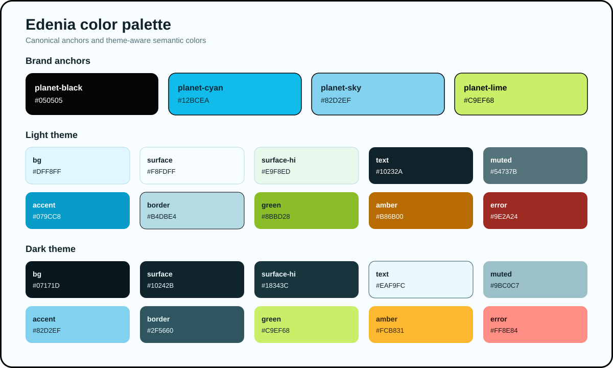

# Edenia Color Bible

Status: current implementation reference, audited 2026-08-31.

Use this document when adding a new element, control, button, state, or data
visualization. The declarations in
[`src/styles/00-foundations.css`](../src/styles/00-foundations.css) are the
executable source of truth. If this document and the CSS disagree, follow the
CSS and update this document in the same pull request.



## The short version

1. Choose a semantic token for the job; do not choose a hex value by appearance.
2. For a button, reuse `btn-primary`, `btn-secondary`, `btn-ghost`, or
   `btn-icon`; add the `btn-danger` modifier to a ghost button for a destructive
   action.
3. Verify default, hover, active, focus-visible, and disabled states in both
   light and dark themes.
4. Keep heatmap, video-status, achievement, and external-brand colors inside
   their existing component families.
5. If the same new meaning needs a color in more than one component, add a
   semantic token instead of copying a raw color.

Edenia's visual signature is high-contrast near-black construction lines,
airy blue-green surfaces, cyan for movement and information, and lime for
forward progress and achievement. Color supports the meaning; labels, icons,
shape, and state attributes still have to carry it without color.

## Brand anchors

These four colors do not change between themes.

| Token | Value | Role | Do not use it as |
| --- | --- | --- | --- |
| `--planet-black` | `#050505` | Expressive outlines, pressed shadows, thumbnail wells, and text on lime | Default body text or a generic dark-theme surface |
| `--planet-cyan` | `#12BCEA` | Brand energy, progress gradients, and the Watch later family | Generic small text on a light background |
| `--planet-sky` | `#82D2EF` | Softer brand blue and dark-theme high contrast | A substitute for every informational state |
| `--planet-lime` | `#C9EF68` | Primary actions, progress, achievements, and earned states | A generic panel background or decoration |

`--planet-white` is deliberately absent from this list: despite its name, it
is a theme-aware control fill (`#FFFFFF` in light theme and `#13272E` in dark
theme), not literal white.

## Theme-aware semantic tokens

| Token | Light | Dark | Use for |
| --- | --- | --- | --- |
| `--bg` | `#DFF8FF` | `#07171D` | Page canvas and lowest visual layer |
| `--surface` | `#F8FDFF` | `#10242B` | Cards, panels, popovers, and toasts |
| `--surface-hi` | `#E9F8ED` | `#18343C` | Hover, selected, or subtly raised surfaces |
| `--planet-white` | `#FFFFFF` | `#13272E` | Inputs, secondary buttons, and compact control fills |
| `--border` | `#B4DBE4` | `#2F5660` | Quiet boundaries and inactive controls |
| `--border-hi` | `#050505` | `#82D2EF` | Emphasized dividers and boundaries that must survive the theme |
| `--text` | `#10232A` | `#EAF9FC` | Primary text and icons |
| `--muted` | `#54737B` | `#9BC0C7` | Secondary copy, metadata, and inactive controls |
| `--accent` | `#079CC8` | `#82D2EF` | Links, interactive emphasis, and information |
| `--accent-dim` | `#087FA6` | `#12BCEA` | Strong labels on pale/tinted informational fills |
| `--green` | `#8BBD28` | `#C9EF68` | Success, completed progress, and positive state |
| `--amber` | `#B86B00` | `#FCB831` | Warning and caution state |
| `--error` | `#9E2A24` | `#FF8E84` | Error and destructive meaning |
| `--mint` | `#EEFBD0` | `#243A20` | Soft positive or hover tint |
| `--soft-blue` | `#E3F6FB` | `#173947` | Soft informational or selection tint |
| `--streak` | `#8BBD28` | `#C9EF68` | Streak-specific progress; keep separate from generic success |
| `--focus-ring` | `#A44F00` | `#FCB831` | Keyboard focus outline |

The body background is the one deliberate canvas gradient:

```css
/* Light */
linear-gradient(180deg, #dff8ff 0%, #eefbd0 54%, #dff8ff 100%)

/* Dark */
linear-gradient(180deg, #07171d 0%, #10242b 55%, #07171d 100%)
```

New cards and controls should sit on the semantic surfaces above rather than
inventing another pale blue, green, or near-black.

## Button hierarchy

Choose button color by the decision the learner is making, not by which color
looks best beside the component.

| Class | Meaning | Current color recipe |
| --- | --- | --- |
| `btn-primary` | The clearest forward or confirm action in a decision group | Lime fill, near-black text/border/shadow; `#D9F789` hover |
| `btn-secondary` | A valid supporting action that should remain visible | Theme-aware `--planet-white` fill, `--text`, near-black border; highlighted-surface hover |
| `btn-ghost` | Back, cancel, later, or other low-emphasis action | Transparent fill, muted text, quiet border; accent text/border on hover |
| `btn-ghost btn-danger` | Destructive or irreversible action | Dedicated red text, border, and tint in each theme; never use red for an ordinary secondary action |
| `btn-icon` | Compact chrome whose icon supplies the accessible meaning | Transparent fill and muted `currentColor`; text-colored icon on hover |

Use the existing classes directly:

```html
<button class="btn-primary" type="button">Continue</button>
<button class="btn-secondary" type="button">Try again</button>
<button class="btn-ghost" type="button">Cancel</button>
<button class="btn-ghost btn-danger" type="button">Delete data</button>
```

Button rules:

- Prefer one primary action per decision group. Two primary buttons are valid
  only when the alternatives truly have equal forward weight, as in profile
  conflict resolution.
- Do not reproduce a button's colors in a new class. Compose the existing base
  class with a layout class, as existing Settings and account controls do.
- Use `currentColor` for SVG strokes and fills so the icon follows the button
  state automatically.
- New buttons need a visible `:focus-visible` treatment using
  `var(--focus-ring)`. Do not copy `var(--focus)`: it appears in older component
  selectors but is not a defined Edenia token.
- Disabled styling is currently component-owned rather than centralized.
  Preserve the native `disabled` attribute, prevent activation, use a
  non-interactive cursor, and make the state understandable without opacity
  alone.

The current base pairings have strong text contrast. Approximate contrast
ratios are `15.56:1` for primary, `16.21:1` for light secondary, and `14.33:1`
for dark secondary. A ghost button is context-dependent because its fill is
transparent; muted text is `4.62:1` on the light `--bg` and `9.36:1` on the
dark `--bg`. These numbers describe the token pairs only; they are not a
substitute for testing the complete control.

## Reusable element recipe

For a new neutral card, panel, or interactive surface, start here:

```css
.new-element {
  background: var(--surface);
  border: 2px solid var(--planet-black);
  color: var(--text);
}

.new-element:hover {
  background: var(--surface-hi);
}

.new-element:focus-visible {
  outline: 3px solid var(--focus-ring);
  outline-offset: 3px;
}

.new-element .meta {
  color: var(--muted);
}
```

Use a quiet `var(--border)` boundary when the heavy near-black outline would
make an element look actionable or more important than it is.

## Component-owned palettes

The following colors are part of the current product, but they are not a menu
for unrelated UI.

### Video state

| Meaning | Current family | Keep it for |
| --- | --- | --- |
| In progress | Amber badge `#FCB831` with `#3C2800`; theme-aware amber pill text | Resume/partial-watch state |
| Watch later | Cyan `#12BCEA`, deep cyan `#087FA6`, light `#DFF8FF`, dark tint `#173947` | Saved watch-later state |
| Favorite | Pink light `#FFE4EC`, border `#E85D86`, text `#BD2452`; dark `#4A2030`/`#FFB2CA` | Favorite state only |
| New/YouTube | Red `#E50914` with white | New-video ribbon and YouTube-owned emphasis |

Selected video action colors live in
[`src/styles/70-video-feed.css`](../src/styles/70-video-feed.css). Reuse those
classes when extending the same state; do not copy their hex values into a new
feature.

### Study heatmap

The heatmap is a seven-step data scale, not a set of surface colors.

| Level | Light | Dark |
| ---: | --- | --- |
| 0 | `#D8EDF2` | `#17333B` |
| 1 | `#EDF9CF` | `#29451F` |
| 2 | `#D9F39A` | `#3B5D24` |
| 3 | `#C2E96B` | `#557D2B` |
| 4 | `#9BD34B` | `#77A536` |
| 5 | `#70AE2F` | `#9DCC43` |
| 6 | `#487D1C` | `#C9EF68` |

Keep the full scale, borders, restricted-history pattern, and theme mapping
together in [`src/styles/60-study-history.css`](../src/styles/60-study-history.css).

### Achievement and external brands

- High streaks use the existing rainbow sequence `#FF6B6B`, `#FFD166`,
  `#8BD450`, `#45C4FF`, `#B181FF`, `#FF6BCB`. It signals exceptional earned
  status, not a general decorative gradient.
- YouTube (`#FF0033` hover), Twitch (`#9146FF`), and support (`#C026D3`) colors
  belong only to their external-brand destinations.
- Goal progress uses the Edenia cyan-to-lime gradient. Completed generic
  progress uses `--green`.

## Accessibility boundaries

- Aim for at least `4.5:1` for normal text, `3:1` for large text, and `3:1` for
  meaningful non-text boundaries and focus indicators.
- `--accent` against the light `--bg` is approximately `2.88:1`. That existing
  pairing is not a precedent for new small text; use a stronger pairing,
  underline/link affordance, or a tested surface treatment.
- Never remove the non-color signal for selected, warning, error, progress, or
  disabled state. Retain labels, icons, borders, patterns, and relevant ARIA or
  native state attributes.
- Inspect both themes. A raw color that works in one often loses contrast or
  changes meaning in the other.
- Check keyboard focus separately from hover. Touch and keyboard users do not
  receive hover as a fallback.

Contrast ratios in this document were calculated from the current sRGB hex
values and rounded to two decimals.

## Change checklist

Before merging a new colored element or changing the palette:

- [ ] The element uses an existing semantic token or documents why a new token is needed.
- [ ] A button reuses the established hierarchy and base class.
- [ ] Light and dark themes are both reviewed.
- [ ] Default, hover, active/selected, focus-visible, and disabled states are reviewed.
- [ ] Text, icon, boundary, and focus contrast are checked in their real context.
- [ ] Meaning remains clear without color.
- [ ] Component-owned heatmap, status, achievement, and brand colors have not leaked into unrelated UI.
- [ ] Any token or canonical button change updates this document and its palette image.
